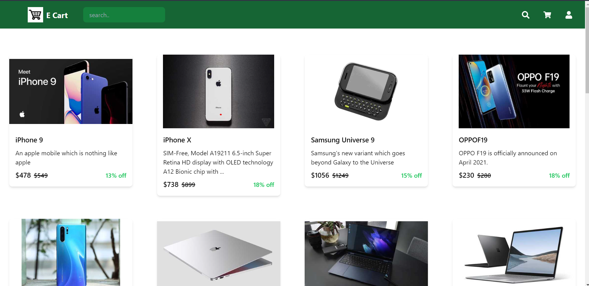
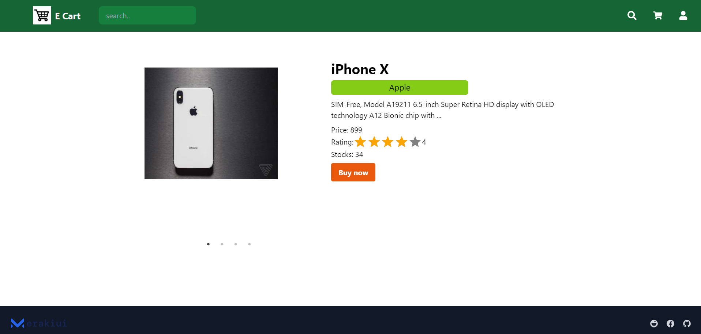

# ClickCart App

Click Cart is an e-commerce website that allows users to browse and purchase products online. It is built using modern web development technologies, including React.js, Tailwind CSS, AOS, React Slick, Axios, Node.js, Express.js, and Cors.

Front-End:
- React.js: A JavaScript library for building user interfaces.
- Tailwind CSS: A utility-first CSS framework for rapid UI development.
- AOS (Animate on Scroll): A library for animating elements as they come into view during scrolling.
- React Slick: A responsive and interactive image slider component.
- Axios: A JavaScript library for making HTTP requests.

Back-End:
- Node.js: A JavaScript runtime environment for server-side development.
- Express.js: A web application framework for building APIs.
- Cors (Cross-Origin Resource Sharing): A mechanism to enable cross-origin communication between the front-end and back-end.

This project aims to provide a seamless and enjoyable shopping experience for users. The front-end components, styled with Tailwind CSS, enable dynamic and efficient UI rendering, while AOS adds visually appealing animations on scroll. React Slick enhances the presentation of product images, allowing users to view multiple images in a responsive manner.

The back-end, powered by Node.js and Express.js, provides the necessary APIs for fetching product information from a database or external sources. Axios is used to make HTTP requests and retrieve data from the server.

Click Cart offers a feature-rich and visually appealing e-commerce website, showcasing the capabilities of React.js, Tailwind CSS, AOS, React Slick, Axios, Node.js, Express.js, and Cors.

## Screenshots

<!-- 

### Features

- **Product Listing:** Display a comprehensive list of products with details such as names, images, prices, and descriptions.
- **Product Details:** Provide in-depth information about each product, including additional images, specifications, customer reviews, and ratings.
- **Responsive Design:** Ensure that the website is fully responsive and optimized for various devices and screen sizes. This allows users to have a consistent experience, whether they are using a desktop computer, tablet, or mobile phone.
- **Animations and Transitions:** Utilize AOS (Animate on Scroll) library to add visually appealing animations and transitions to elements as they come into view during scrolling.

Feel free to explore the repository for detailed implementation and code samples.

## Technologies Used

- React.js
- Tailwind CSS
- Axios
- React Icons
- React slick
- AOS -->

    